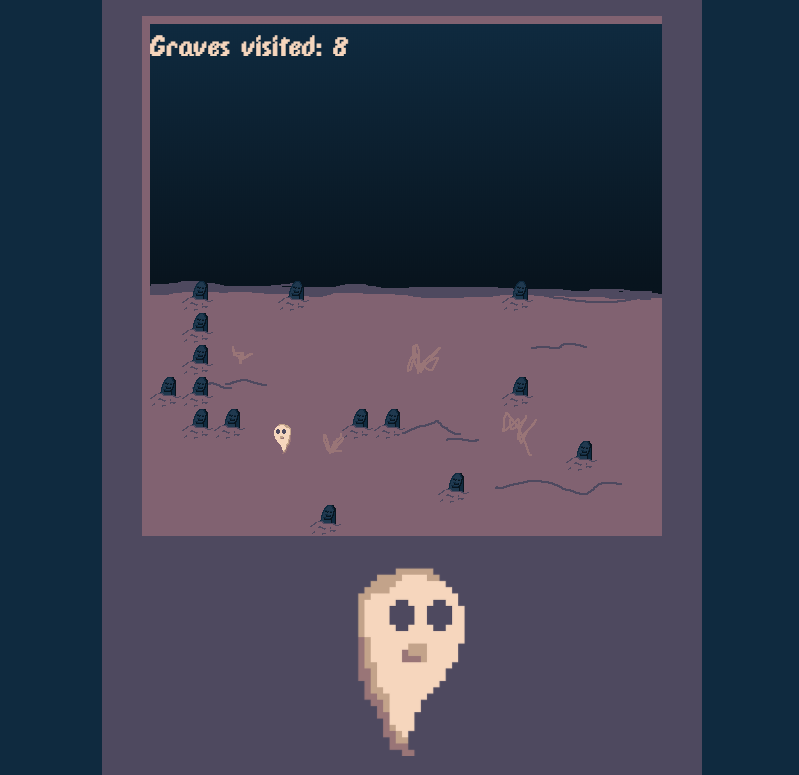

# Death is a Party

## Description
Death is not the end... it's a party! This HTML5 Canvas is being made for [TriJam 49](https://itch.io/jam/trijam-49)

##Concept

You are a ghost, who wakes at dusk, and has until dawn to wake up as many of you friends as possible.

[x] Create moveable ghost sprite
[x]Create dusk-to-dawn sky change and game over timer
[x] Randomly place graves
[x] Wake up ghosts and count
[x] Score and restart
[x] Add introduction (On a grave!)
[x] Ghost animations
[x] Music

MVP+
1. Add Ascii hedge maze - running water?
2. Add multiple screens to explore
3. Game controller support?

## Attributions

### Colors
- [NYX8 PALETTE by Javier Guerrero](https://lospec.com/palette-list/nyx8)

### Fonts
- Font: [DPComic Font by codeman38](https://www.1001fonts.com/dpcomic-font.html)

### Music
- [Inspector Unvisible by Lobo Loco](https://freemusicarchive.org/music/Lobo_Loco/Experimental_Space/Inspector_Unvisible_ID_1211)

### Code and Organization

#### Intro to Game Development with JavaScript by Chris Perko
- [On YouTube](https://www.youtube.com/watch?v=3EMxBkqC4z0)
- [Completed Project](https://codesandbox.io/s/z2pqr9620m)
